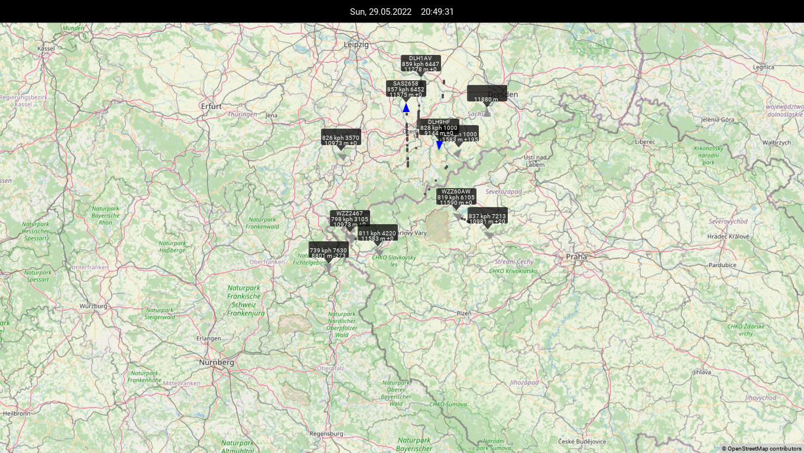

# ADS-B Dashboard
Kivy-based map view visualizing aircraft ADS-B data retrieved from a dump1090-mutability webserver

## Features
* Permanent data retrieval from dump1090-mutability with configured webserver (see link below)
* Center marker at defined coordinates
* Arrow marker for each aircraft indicating direction and state (blue means position received, grey means timeout)
* Bubble showing flight number, speed, squawk, altitude and climb/sink rate for each aircraft
* Trace dots at each received position of an aircraft
* All objects related to an aircraft are removed on timeout
* Statusbar with date, time and space for own extensions at the top of the screen
* May run on a single or two machines (tested with two Raspberry Pis: one as decoder, another one running this dashboard)

Screenshots (click to expand)

  </img>

## Additional Information
* Created with Kivy 1.11.0 using Python 3.9.2
* Adjust latitude, longitude, zoom level and dump1090 hostname at the top as well as resolution at the bottom of main.py to your needs
* With running X server: `python main.py`
* Without running X server (e.g. on Raspberry Pi OS Lite): `startx /path/to/dashboard.sh` (you possibly need to update the path inside this script as well)
* Autostart e.g. by appending the command to `/etc/rc.local` (ending with ` &` to start in background)

## References
* ADS-B decoder for RTL-SDR: https://github.com/adsbxchange/dump1090-mutability
* Kivy MapView widget: https://github.com/kivy-garden/mapview
